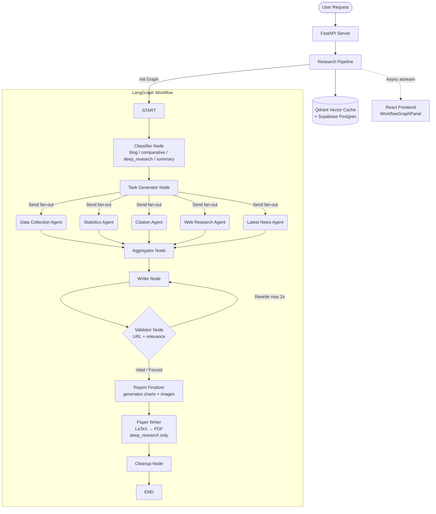
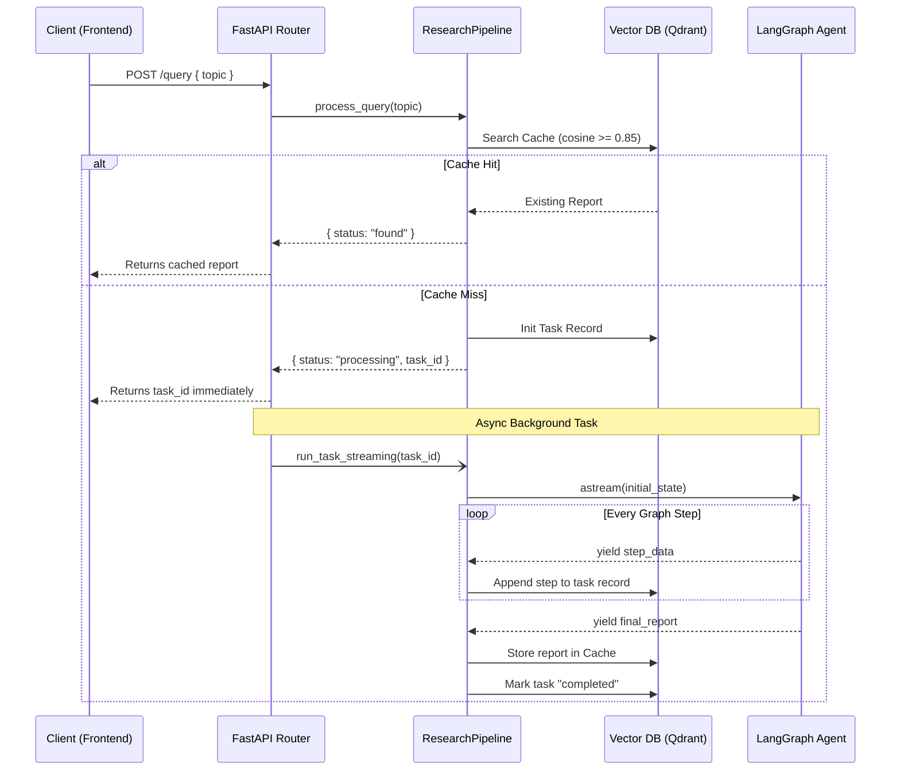
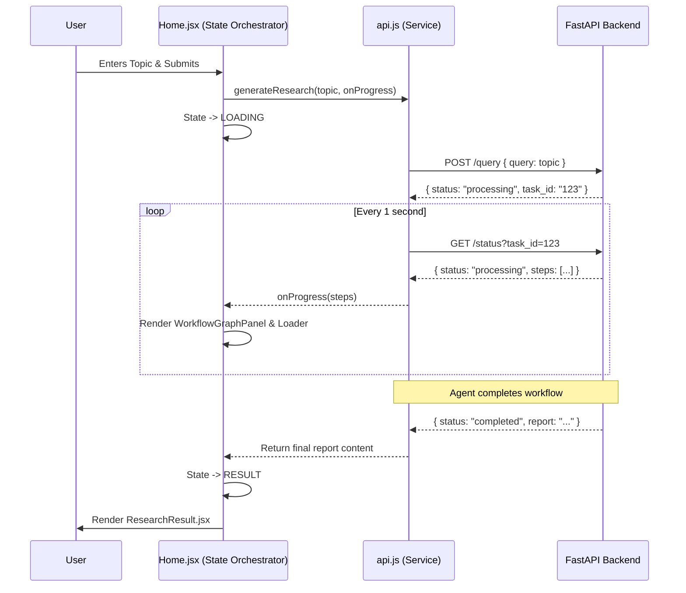

# Aion AI Research Agent

A comprehensive, production-ready AI-powered research system that orchestrates a team of specialized sub-agents to generate, analyze, and synthesize detailed research reports. It consists of a FastAPI + LangGraph backend and a Vite + React frontend.

## 🌟 System Architecture & Workflow

The system uses a **LangGraph multi-agent workflow** where specialized sub-agents (Data Collection, Statistics, Citation, Web Research, Latest News) execute in parallel, then the results are aggregated, written, validated, enriched with charts, and — for deep research queries — converted into a LaTeX/PDF academic paper.



Each sub-agent has direct access to **9 source-fetching tools** — `fetch_hackernews`, `fetch_youtube`, `fetch_github`, `fetch_linkedin`, `fetch_reddit`, `fetch_rss`, `fetch_google_news`, `fetch_podcasts`, `fetch_arxiv` — plus a `think_tool` for reflection. All sources are queried via native async HTTP, no external MCP hop.

## 🚀 Setup and Run the System

### Prerequisites
- Node.js (v18+)
- Python (v3.10+)
- `uv` (Fast Python package manager)
- Google GenAI API Key (for Gemini 2.5 Flash)

### 1. Backend Setup

The backend utilizes `uv` for dependency management and runs on FastAPI.

```bash
# Navigate to the backend directory
cd backend

# Install uv if you haven't already
curl -LsSf https://astral.sh/uv/install.sh | sh

# Sync dependencies
uv sync

# Configure environment variables
cp .env.example .env
# Open .env and add your GOOGLE_API_KEY and other credentials
```

**Run the Backend Server:**
```bash
# Starts the FastAPI server on http://localhost:8000
uv run run.py
```

### 2. Frontend Setup

The frontend is a Vite + React application.

```bash
# Navigate to the frontend directory
cd frontend

# Install dependencies
npm install

# Configure environment variables
cp .env.example .env.local
# Make sure VITE_API_BASE_URL points to the backend (e.g., http://localhost:8000)

# Start the dev server
npm run dev
```
By default, the frontend will be available at `http://localhost:5175` or `http://localhost:3001` (based on your Vite port config).

---

## 🧩 Component Breakdown & Code Structure

### 1. The API Layer (Backend)
The FastAPI server (`backend/src/api/server.py`) handles HTTP requests. It uses background tasks to stream agent steps without blocking the thread pool.

**Backend Data Flow:**



```python
# backend/src/api/server.py
@app.post("/query", response_model=QueryResponse)
async def create_query(request: QueryRequest, user: dict = Depends(get_current_user)):
    # 1. Start processing the query
    result = pipeline.process_query(request.query)

    if result["status"] == "processing":
        # 2. Async stream is scheduled as a background task
        asyncio.create_task(
            pipeline.run_task_streaming(result["task_id"], request.query)
        )

    # 3. Immediately return the task_id to the client
    return QueryResponse(**result)
```

### 2. The LangGraph Agent Workflow (Backend)
The `WorkflowGraphBuilder` (`backend/src/lg_workflow_agent/graph.py`) defines the state machine of the research agent. It uses `StateGraph` to manage transitions between the classifier, task generator, sub-agents, writer, and validator nodes.

```python
# backend/src/lg_workflow_agent/graph.py
def build(self):
    wf = StateGraph(WorkflowState)

    wf.add_node("classifier", create_node_classifier(self.llm, self.db))
    wf.add_node("task_generator", create_node_task_generator(self.llm, self.db))
    # ... sub-agent nodes added here ...

    # Linear front: START -> classify -> task_gen -> fan-out
    wf.add_edge(START, "classifier")
    wf.add_edge("classifier", "task_generator")

    # Dynamic fan-out to specialized agents based on task breakdown
    wf.add_conditional_edges(
        "task_generator",
        create_assign_workers(),
        SUBAGENT_NODE_NAMES,
    )
    
    # ... aggregation and writing edges ...
    
    # Validation loop
    wf.add_conditional_edges(
        "validator",
        create_validation_route(),
        {"valid": "report_finalizer", "rewrite": "writer"},
    )
    
    return wf.compile()
```

### 3. The React Frontend (UI)
The frontend uses a state-machine-like approach in its main component (`frontend/src/pages/Home.jsx`) to cycle through Idle, Loading (Streaming), Result, or Error states. It streams the data by polling the streaming endpoint.

**Frontend Data Flow & State Management:**



**Key Frontend Modules & Components:**

- **`pages/Home.jsx` (State Orchestrator)**
  Manages the core `idle → loading → result/error` workflow. It ties the API polling loop with the view rendering.
  ```javascript
  // snippet from Home.jsx
  const handleSubmit = async (topic) => {
    setAppState(STATE.LOADING)
    try {
      const data = await runResearchQuery(topic, {
        onProgress: ({ status, steps }) => setProgressSteps(steps)
      })
      setResearch({ topic, content: data.content })
      setAppState(STATE.RESULT)
    } catch (err) {
      setAppState(STATE.ERROR)
    }
  }
  ```

- **`components/WorkflowGraphPanel.jsx` (Live Diagram)**
  A custom interactive SVG panel that visually tracks the LangGraph steps in real-time. It maps backend step logs (e.g., `classifier`, `writer`) to a dynamic LangGraph flowchart using CSS animations.

- **`components/ResearchResult.jsx` (Markdown Renderer)**
  Responsible for rendering the final generated markdown using `react-markdown`. It features custom URL transformations to render base64 embedded charts safely, and handles "Copy" and "Download .md" functionality.
  ```javascript
  // snippet from ResearchResult.jsx
  <ReactMarkdown
    remarkPlugins={[remarkGfm]}
    urlTransform={(url) => /^data:image\/(png|jpe?g);/i.test(url) ? url : ''}
  >
    {content}
  </ReactMarkdown>
  ```

- **`components/TopicInput.jsx` & `components/Loader.jsx`**
  Handles user queries and visual feedback while polling the background task.

- **`services/api.js`**
  Manages communication with the FastAPI backend, initiating queries and polling `GET /status`.
  ```javascript
  // snippet from api.js
  while (true) {
      const statusRes = await axios.get(`${API_BASE}/status?task_id=${task_id}`);
      if (statusRes.data.status === 'completed') return statusRes.data.report;
      await new Promise(r => setTimeout(r, 1000)); // poll every 1s
  }
  ```

### 4. Database Integration
The system uses two persistence layers:
- **Qdrant** (`backend/src/db/database.py`) — vector cache for prior research reports; semantic similarity search (cosine ≥ 0.85) avoids redundant work and can fall back to an in-memory instance when `QDRANT_URL` is unset.
- **Supabase Postgres** (`backend/src/db/postgres.py`, `backend/src/db/supabase_client.py`) — task lifecycle tracking, per-user history, and step persistence keyed by `task_id`.

```python
# backend/src/db/postgres.py (Conceptual DB interaction)
def record_research_task(task_id, user_id, query, ...):
    # Store the initial task state in DB
    # Keeps track of which user initiated the workflow
    pass
```

## Summary
The combination of FastAPI (for async IO), LangGraph (for complex stateful multi-agent workflows), and React (for dynamic real-time visualization) forms a highly scalable AI application framework.
