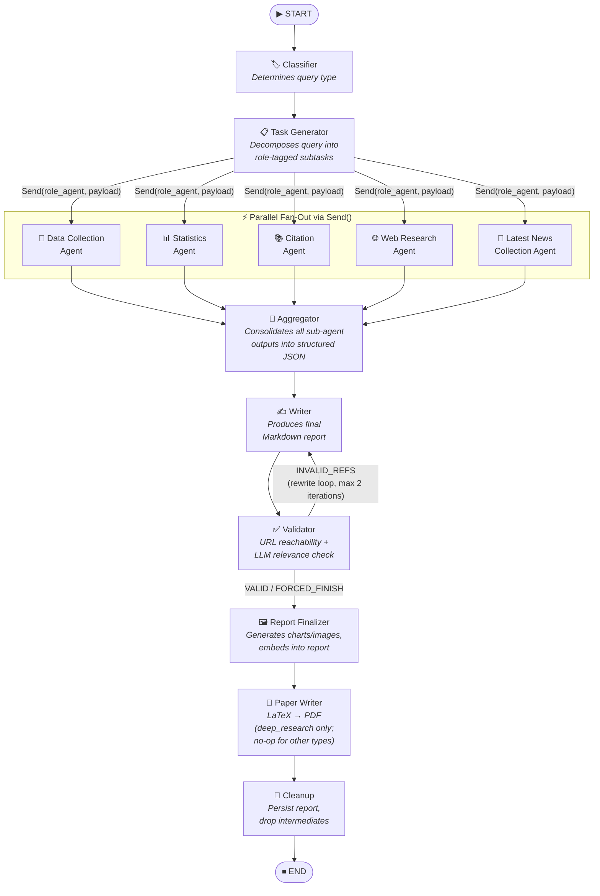
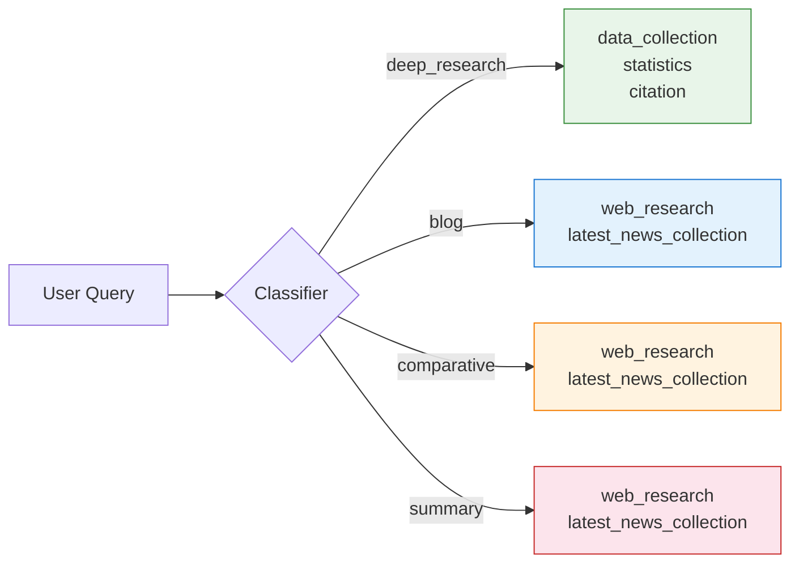
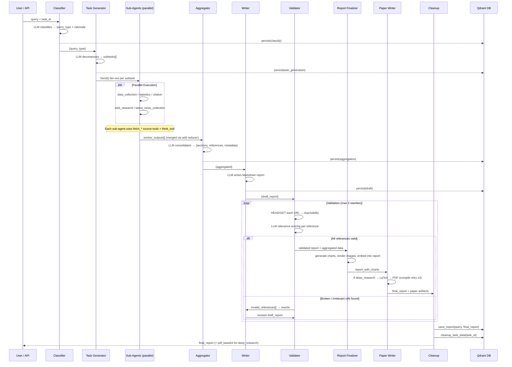
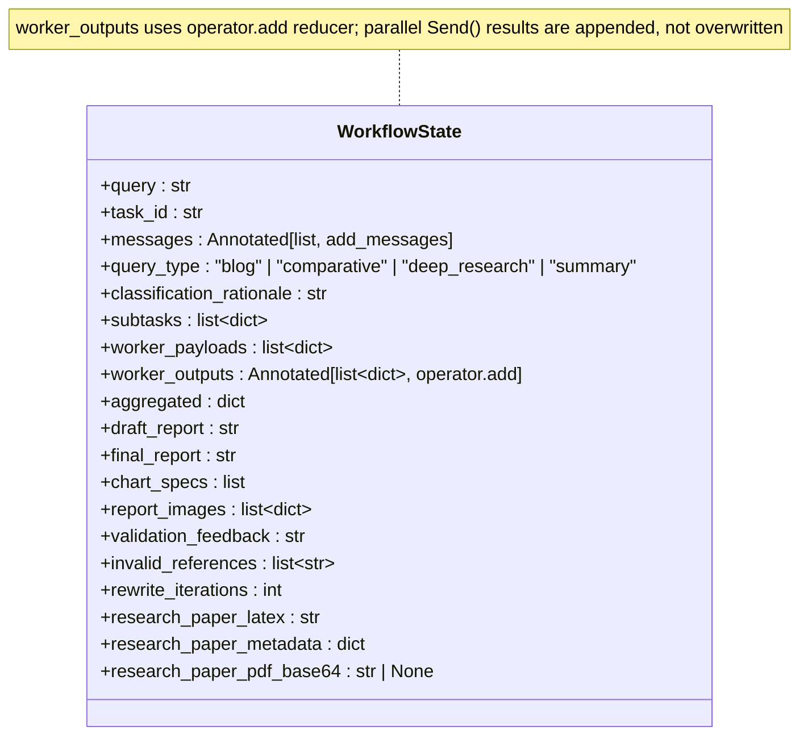
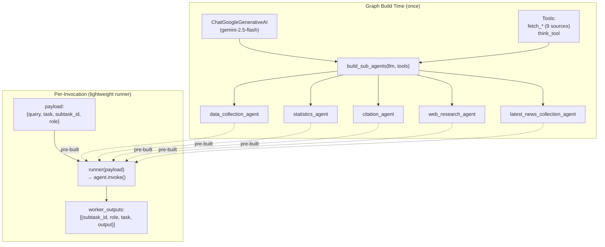
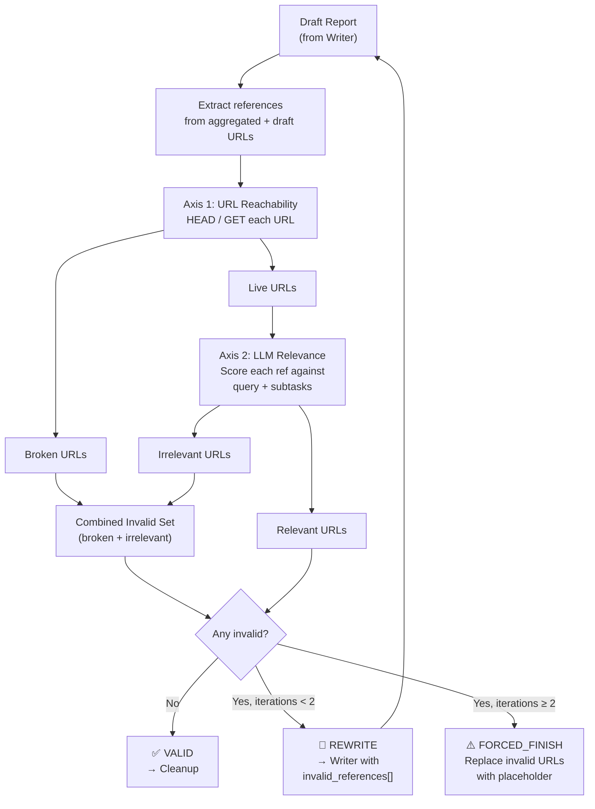
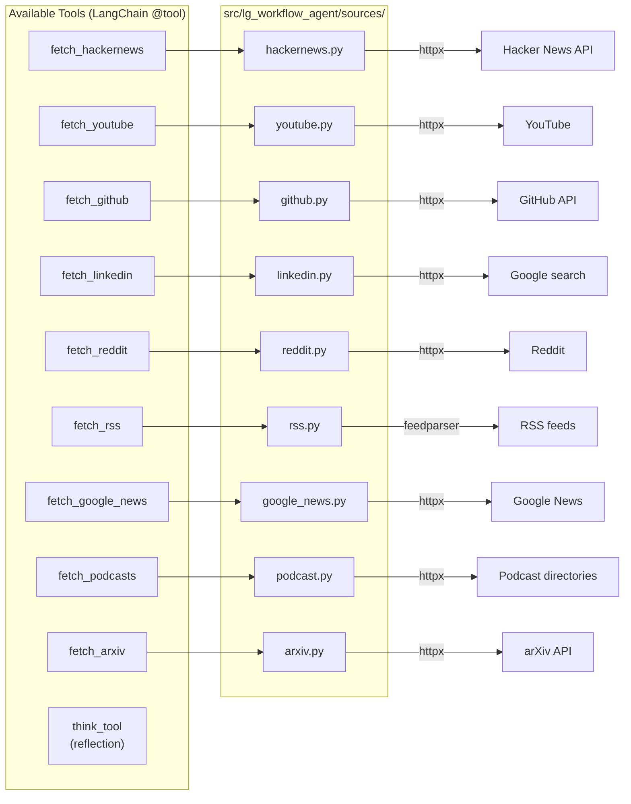
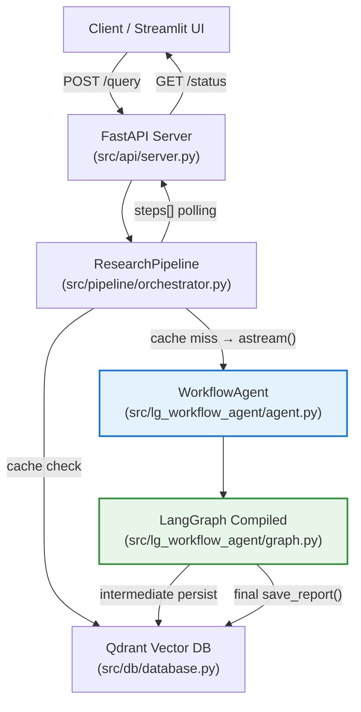

# LG Workflow Agent — Architecture & Flow

Complete architecture reference for the **LangGraph multi-agent research workflow** (`src/lg_workflow_agent/`).

---

## 1. High-Level Graph Flow



---

## 2. Query-Type Role Mapping

The **Classifier** assigns one of four query types. Each type activates a different subset of sub-agents for the parallel fan-out:



| Query Type | Activated Sub-Agents | Use Case |
|---|---|---|
| `deep_research` | `data_collection`, `statistics`, `citation` | Rigorous, citation-heavy investigation |
| `blog` | `web_research`, `latest_news_collection` | Informal/explanatory article |
| `comparative` | `web_research`, `latest_news_collection` | Compare/contrast entities or tools |
| `summary` | `web_research`, `latest_news_collection` | Short factual digest or overview |

---

## 3. Detailed Node-by-Node Flow



---

## 4. State Schema

All data flows through a single `WorkflowState` (TypedDict). Key fields and their reducers:



| Field | Set By | Consumed By |
|---|---|---|
| `query`, `task_id`, `messages` | Initial input | All nodes |
| `query_type`, `classification_rationale` | Classifier | Task Generator, Aggregator, Validator |
| `subtasks`, `worker_payloads` | Task Generator | Assign Workers (fan-out) |
| `worker_outputs` | Sub-agents (additive) | Aggregator |
| `aggregated` | Aggregator | Writer, Validator |
| `draft_report` | Writer | Validator |
| `final_report` | Validator / Report Finalizer | Paper Writer, Cleanup, API response |
| `chart_specs` | Report Finalizer | Report Finalizer / Cleanup |
| `report_images` | Report Finalizer | Cleanup / persisted report payload |
| `invalid_references`, `rewrite_iterations` | Validator | Writer (rewrite loop) |
| `research_paper_latex` | Paper Writer | Cleanup / persisted payload |
| `research_paper_metadata` | Paper Writer | Cleanup / persisted payload |
| `research_paper_pdf_base64` | Paper Writer | API response (`/status`) for deep_research queries |

> Note: The `Report Finalizer` node enriches validated drafts with auto-generated charts and embedded image assets. For `deep_research` queries, the downstream `Paper Writer` then produces a LaTeX manuscript that is compiled to PDF (returned as base64 in `research_paper_pdf_base64`). For all other query types the paper writer is a no-op.

---

## 5. Sub-Agent Architecture

Each sub-agent is a pre-built `create_agent` instance constructed **once** at graph-build time and reused across all invocations.



### Sub-Agent Responsibilities

| Agent | System Prompt Focus | Output Format |
|---|---|---|
| **Data Collection** | Primary facts from authoritative sources | `## Findings` + `## Sources` |
| **Statistics** | Quantitative data, benchmarks, growth rates | `## Key Statistics` + `## Analysis` + `## Sources` |
| **Citation** | High-quality references (papers, docs, standards) | `## References` with one-line notes |
| **Web Research** | Diverse current web information | `## Findings` + `## Sources` |
| **Latest News Collection** | Recent news links + short snippets only | `## Latest News` bullet list (5-10 items, no prose) |

---

## 6. Validation & Rewrite Loop

The Validator performs a two-axis check on every reference in the draft:



---

## 7. Tools

Each sub-agent has direct access to one source-fetching tool per supported platform plus a reflection tool. All fetchers are **native async** — they call the underlying source API directly (no external MCP server in the loop):



Each fetcher returns a Pydantic `SourceResult` serialised to JSON for the LLM. The active set of tools is identical across sub-agents; prompts steer which sources are appropriate per role.

Additionally, the **Validator node** uses internal URL-checking utilities (not agent tools):
- `extract_urls(text)` — regex extraction of HTTP/HTTPS URLs from text
- `validate_url(url)` — HEAD/GET reachability check
- `validate_urls(urls)` — batch validation returning `{url: bool}`

And the **Paper Writer node** uses LaTeX utilities from `paper_formatter.py`:
- `clean_latex(text)` — strip stray markdown / artefacts
- `validate_latex(text)` — structural sanity check
- `compile_latex_to_pdf(text)` — `pdflatex` invocation with error capture
- `extract_paper_metadata(text)` — title/abstract/word-count extraction
- `pdf_to_base64(path)` — final encoding for API transport

---

## 8. Module Map

```
src/lg_workflow_agent/
├── __init__.py          # Public API exports: WorkflowAgent, WorkflowGraphBuilder, WorkflowState
├── agent.py             # WorkflowAgent — top-level entry point (build, invoke, astream)
├── graph.py             # WorkflowGraphBuilder — LangGraph StateGraph construction
├── nodes.py             # Node factories (classifier, task_gen, sub-agent runners, aggregator,
│                       #                writer, validator, report_finalizer, paper_writer, cleanup)
├── prompts.py           # All LLM prompt templates
├── state.py             # WorkflowState TypedDict with reducer annotations
├── sub_agents.py        # build_sub_agents() + build_role_runners() factories
├── tools.py             # @tool fetchers + URL validation utilities
├── chart_generator.py   # matplotlib renderers for 12+ chart/diagram types → base64 PNG
├── paper_formatter.py   # LaTeX cleaning, validation, pdflatex compilation, PDF → base64
├── run_sample.py        # Standalone sample script
└── sources/             # Direct async source fetchers (no MCP)
    ├── arxiv.py
    ├── github.py
    ├── google_news.py
    ├── hackernews.py
    ├── linkedin.py
    ├── podcast.py
    ├── reddit.py
    ├── rss.py
    ├── youtube.py
    ├── _config.py       # Shared HTTP config (timeouts, headers, retries)
    ├── _feed_utils.py   # RSS/feed helpers
    └── _models.py       # SourceResult Pydantic schema
```

---

## 9. Integration with the Wider System



The `WorkflowAgent` is the sole research runtime exposed to the pipeline. It compiles the LangGraph once at startup and exposes the standard `build()` / `invoke(query)` / `astream(query)` interface used by `ResearchPipeline`. The workflow decomposes the query into parallel specialized sub-agents before producing the final report, then enriches it with charts and (for deep research) a compiled LaTeX PDF.

---

## 10. Key Design Decisions

| Decision | Rationale |
|---|---|
| **Fan-out via `Send()`** | LangGraph's `Send` dispatches sub-agents in parallel; `worker_outputs` uses `Annotated[list, operator.add]` so results are appended, never overwritten |
| **Latest News Collection (not Content Drafting)** | The drafting role was running in parallel with research, producing prose without data. Replaced with a focused news-link collector; actual prose is written by the downstream **Writer** node which has access to all aggregated data |
| **Two-axis validation** | URL reachability alone isn't sufficient — an accessible but off-topic page is equally harmful. LLM relevance scoring catches fabricated or tangential references |
| **Max 2 rewrites** | Prevents infinite loops when the LLM keeps generating bad references. After 2 rewrites, invalid URLs are replaced with `[invalid link removed]` |
| **Sub-agents built once** | `create_agent` is called at graph-build time, not per-invocation. Runners are lightweight closures that just call `.invoke()` on the pre-built agent |
| **Direct source fetchers (no MCP)** | Each source now has a native async module under `sources/`. Eliminating the MCP hop removes a network round-trip per tool call, a deployment dependency, and a class of timeout / cold-start failures |
| **Paper writer is a single node, not a sub-graph** | The LaTeX compile-fix loop happens inside `node_paper_writer` (up to 3 attempts with an LLM-driven fix prompt). Keeping it as a single node avoids polluting the public graph topology with deep-research-only edges |
| **Best-effort persistence** | `_persist()` wraps all DB writes in try/except so a Qdrant or Postgres outage never breaks the workflow |