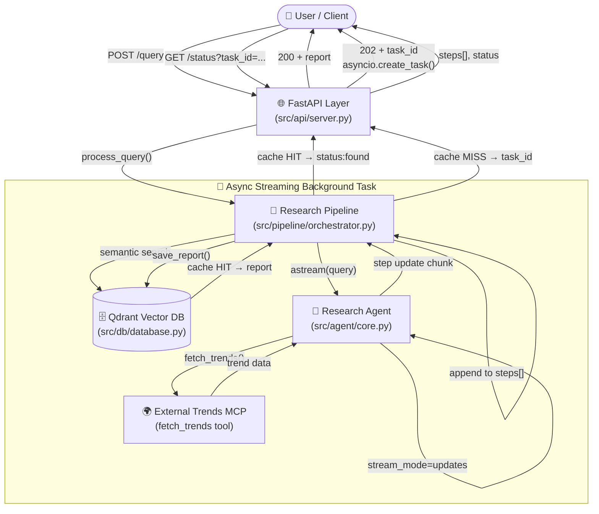
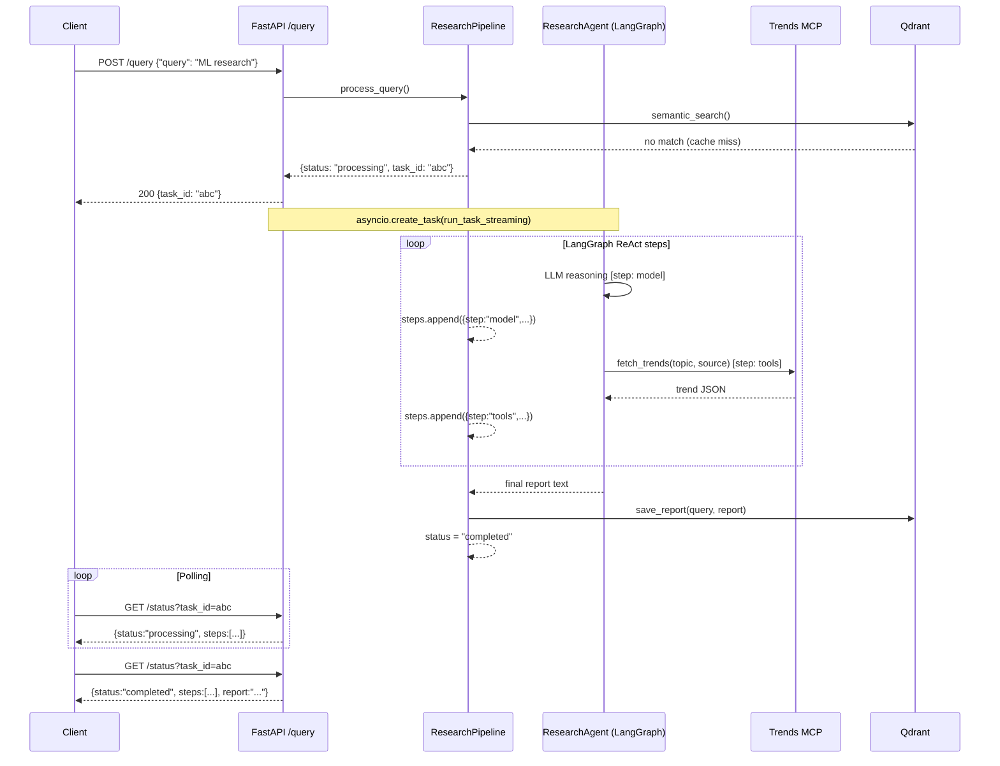
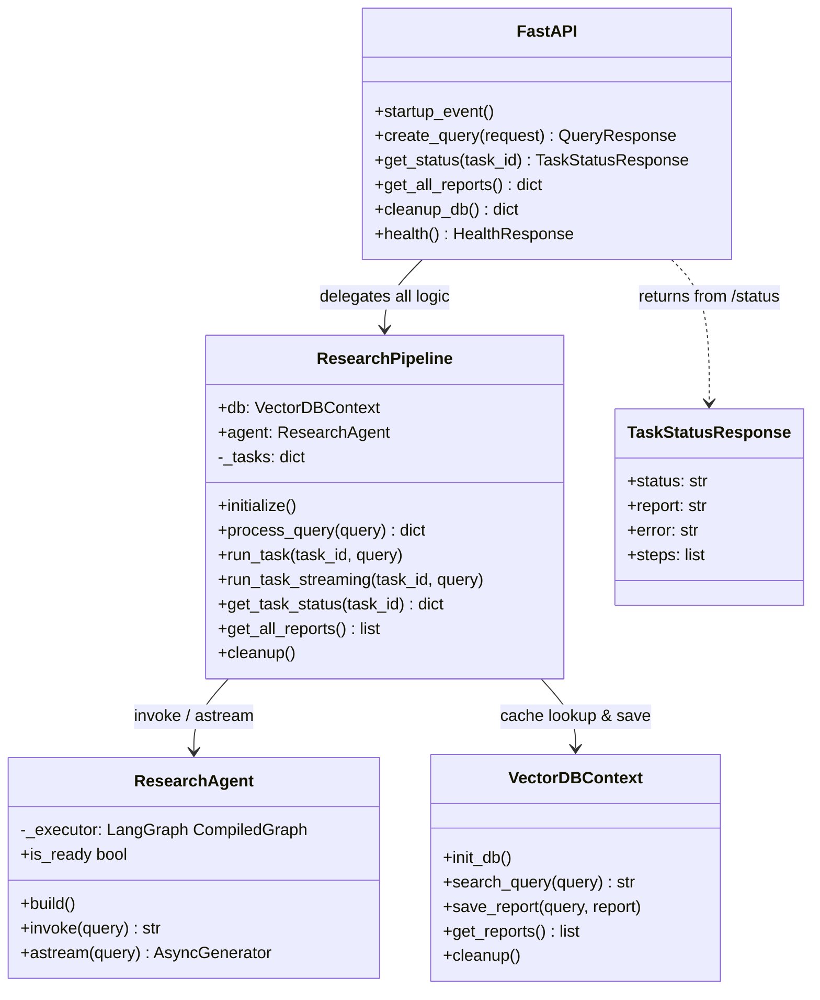
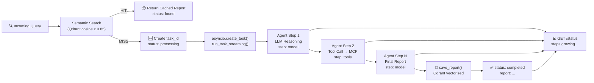
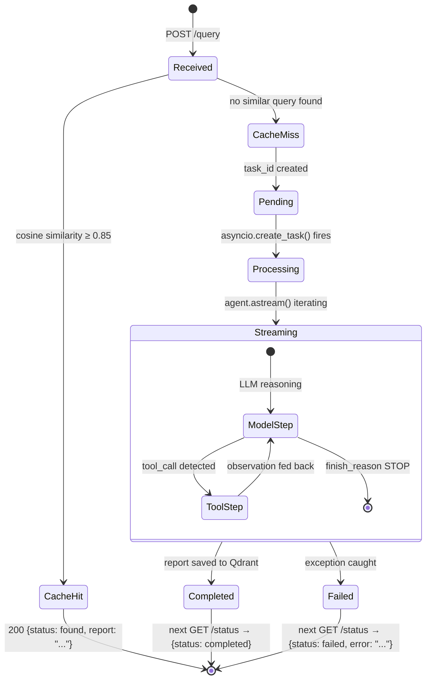

# System Architecture & Flow

This document details the internal architecture, component interaction, request lifecycle, and the new **streaming agent progress** design of the AI Research System.

---

## High-Level Architecture

The system is built as a modular, tiered architecture that cleanly separates the API interface, business orchestration, intelligent reasoning, and vector storage.



---

## Streaming Agent Progress Flow

When the cache misses, the `/query` endpoint fires a **non-blocking async task** that streams each LangGraph node completion back to an in-memory task record. Clients poll `/status` to see `steps[]` grow in real time.



---

## Component Interaction Map



---

## Data Flow — Cache Hit vs Miss



---

## Core Components

### 1. API Layer — `src/api/`

The application entry point using **FastAPI**.

- **`server.py`** — All route definitions. `/query` is `async def` so `asyncio.create_task()` can be called directly on the event loop without blocking.
- **`models.py`** — Pydantic request/response schemas, including the `TaskStatusResponse.steps` field added for streaming.

### 2. Research Pipeline — `src/pipeline/orchestrator.py`

The orchestration hub between the DB and the agent.

| Method | Purpose |
|---|---|
| `process_query()` | Cache lookup; returns report or new `task_id` |
| `run_task()` | Sync agent invocation (original, untouched) |
| `run_task_streaming()` | **Async** — iterates `agent.astream()`, appends each step to `task["steps"]` in real time |
| `get_task_status()` | Returns the live task dict (polled by `/status`) |

### 3. Research Agent — `src/agent/core.py`

A **LangGraph ReAct graph** backed by `gemini-2.5-flash`.

| Method | Mode | Description |
|---|---|---|
| `build()` | Lifecycle | Compiles the LangGraph agent once at startup |
| `invoke(query)` | Sync | Blocking full run — returns final report string |
| `astream(query)` | **Async generator** | Yields `{step, content, data}` after every LangGraph node |

`astream()` calls the executor with `stream_mode="updates"`, meaning a chunk is emitted after **each node** (LLM call, tool call, etc.) completes — not just token-by-token.

### 4. Vector Database — `src/db/database.py`

A **Qdrant**-backed RAG layer.

- **Embeddings**: `models/gemini-embedding-001` → 3072-dimensional vectors
- **Similarity**: Cosine distance, threshold 0.85
- **Collections**: Named `research_reports`

---

## Request Lifecycle (Detailed)



---

## Testing Strategy

| Layer | Files | Coverage |
|---|---|---|
| Unit | `tests/test_agent.py`, `tests/test_pipeline.py` | Agent build/invoke mocks, pipeline state machine |
| Integration — Streaming | `tests/test_streaming.py` | Direct `astream()` + full HTTP poll flow |
| Interactive | `tests/component_checks.ipynb` | Manual DB / Agent / Pipeline exploration |

```bash
# All unit tests
uv run pytest tests/

# Streaming integration (requires live server)
uv run python tests/test_streaming.py
```

See the [Tests Directory](../tests/) for full details.
