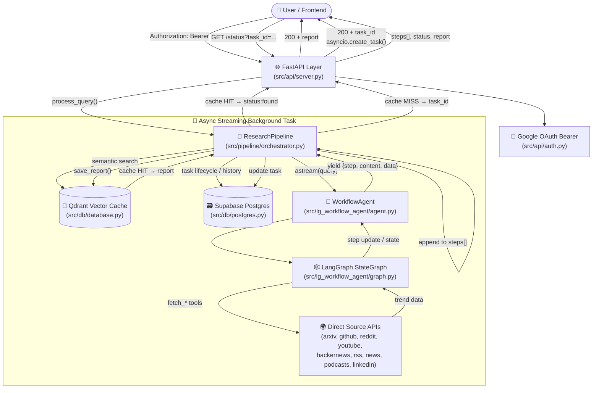
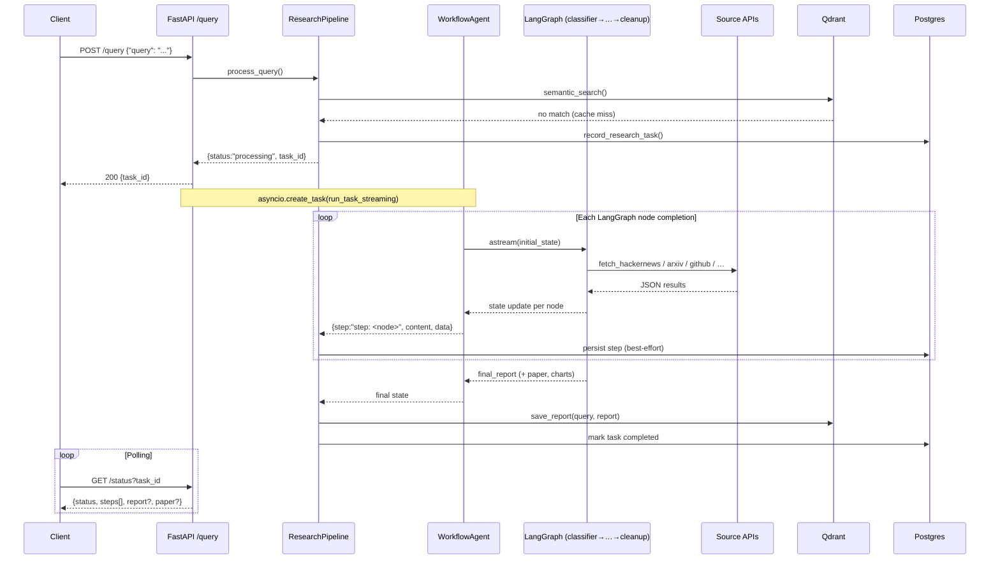
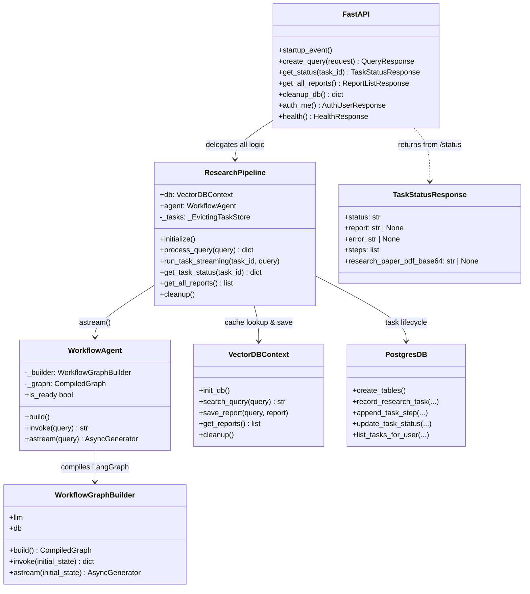
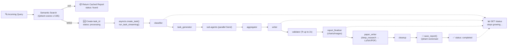
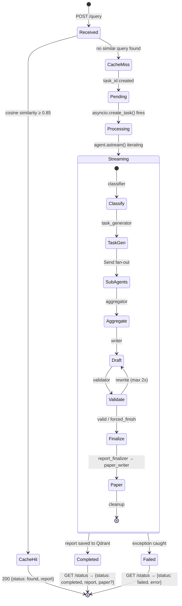

# System Architecture & Flow

This document describes the high-level architecture of the **Aion AI Research** backend: the FastAPI API layer, the `ResearchPipeline` orchestrator, the `WorkflowAgent` LangGraph multi-agent runtime, the dual persistence layers (Qdrant + Supabase Postgres), and the streaming progress design.

For the full reference of the multi-agent LangGraph workflow itself (nodes, sub-agents, validation loop, paper generation), see [LANGGRAPH_WORKFLOW.md](LANGGRAPH_WORKFLOW.md).

---

## High-Level Architecture



---

## Streaming Agent Progress Flow

When the cache misses, `/query` schedules a **non-blocking async task** that iterates `WorkflowAgent.astream()` and appends every LangGraph node completion to an in-memory task record. Clients poll `/status` to watch `steps[]` grow.



---

## Component Interaction Map



---

## Data Flow — Cache Hit vs Miss



---

## Core Components

### 1. API Layer — `src/api/`

FastAPI application entry point.

- **`server.py`** — Route definitions. `/query` is `async def` so `asyncio.create_task()` runs on the event loop without blocking. CORS origins are configurable via `CORS_ORIGINS`.
- **`auth.py`** — Google OAuth bearer-token validation. Honors `AUTH_DISABLED=true` for local development.
- **`models.py`** — Pydantic request/response schemas, including `TaskStatusResponse.steps` and the optional `research_paper_pdf_base64` produced by deep-research runs.

### 2. Research Pipeline — `src/pipeline/orchestrator.py`

Stateful orchestration hub between the API, the DB layers, and the agent.

| Method | Purpose |
|---|---|
| `initialize()` | Lazily builds the `WorkflowAgent` and warms the Qdrant collection. |
| `process_query()` | Cache lookup. Returns either `{status:"found", report}` or `{status:"processing", task_id}`. |
| `run_task_streaming()` | Async — iterates `agent.astream()`, appends each step to `task["steps"]`, persists progress to Postgres, then saves the final report to Qdrant. |
| `get_task_status()` | Returns the live task dict polled by `/status`. |
| `_tasks` | Bounded `_EvictingTaskStore` (max 5 completed tasks, 10-minute TTL) to bound process memory. |

Memory hygiene: `_release_memory()` closes lingering matplotlib figures and runs a GC pass after each task to keep the chart generator from leaking pyplot state.

### 3. WorkflowAgent — `src/lg_workflow_agent/`

A **LangGraph multi-agent workflow** backed by `gemini-2.5-flash`.

| Method | Mode | Description |
|---|---|---|
| `build()` | Lifecycle | Instantiates the LLM and compiles the StateGraph once at startup. |
| `invoke(query)` | Sync | Blocking full run — returns final report string. |
| `astream(query)` | **Async generator** | Yields `{step, content, data}` after every LangGraph node completes (classifier, task_generator, each sub-agent, aggregator, writer, validator, report_finalizer, paper_writer, cleanup). |

The graph topology, sub-agent prompts, and validation logic are documented in [LANGGRAPH_WORKFLOW.md](LANGGRAPH_WORKFLOW.md). At a glance:

```
START → classifier → task_generator
      → [data_collection | statistics | citation | web_research | latest_news_collection]   (parallel Send fan-out)
      → aggregator → writer → validator ⤺ (rewrite ×0..2)
      → report_finalizer (charts/images) → paper_writer (LaTeX/PDF, deep_research only) → cleanup → END
```

### 4. Vector Database — `src/db/database.py`

A **Qdrant**-backed RAG cache.

- **Embeddings**: `models/gemini-embedding-001` → 3072-dimensional vectors.
- **Similarity**: Cosine distance, threshold 0.85.
- **Collection**: `research_reports`.
- **Fallback**: When `QDRANT_URL` is unset, an in-memory Qdrant instance is used (useful for local development and CI).

### 5. Supabase Postgres — `src/db/postgres.py`, `src/db/supabase_client.py`

Relational layer for **per-user task lifecycle**:

- Records each research task with `task_id`, `user_id`, query, timestamps.
- Appends step-level progress so the workflow can be inspected after the in-memory task has been evicted.
- Powers the user's history view in the frontend.

All Postgres writes are best-effort — failures are logged but do not break the agent run.

### 6. Source Fetchers — `src/lg_workflow_agent/sources/`

Each source has a small async module that hits its native API and returns a Pydantic `SourceResult`:

`arxiv` · `github` · `google_news` · `hackernews` · `linkedin` (via Google search) · `podcast` · `reddit` · `rss` · `youtube`

These are wrapped as LangChain `@tool`s in `src/lg_workflow_agent/tools.py` (`fetch_arxiv`, `fetch_github`, …) and exposed to every sub-agent. No external MCP hop is involved.

---

## Request Lifecycle (Detailed)



---

## Testing Strategy

| Layer | Files | Coverage |
|---|---|---|
| Unit | `tests/test_agent.py`, `tests/test_pipeline.py`, `tests/test_postgres_tasks.py` | Agent build/invoke mocks, pipeline state machine, Postgres CRUD |
| Sources | `tests/test_sources.py` | Each direct source fetcher (mocked HTTP) |
| Streaming | `tests/test_streaming.py` | Direct `astream()` + full HTTP poll flow |
| Visualizations | `tests/test_enhanced_visualizations.py`, `tests/test_visualization_integration.py` | Chart generator + finalizer integration |
| API | `tests/test_api.py`, `tests/smoke_test_api.py` | FastAPI routes, auth, status polling |
| Interactive | `tests/component_checks.ipynb`, `tests/lg_workflow_agent_checks.ipynb` | Manual exploration notebooks |
| Dashboard | `tests/streamlit_app.py` | Visual progress monitor over the live API |

```bash
# All unit tests
uv run pytest tests/

# Streaming integration (requires live server)
uv run python tests/test_streaming.py

# Visual dashboard
uv run streamlit run tests/streamlit_app.py
```

See the [tests/](../tests/) directory for full details.
